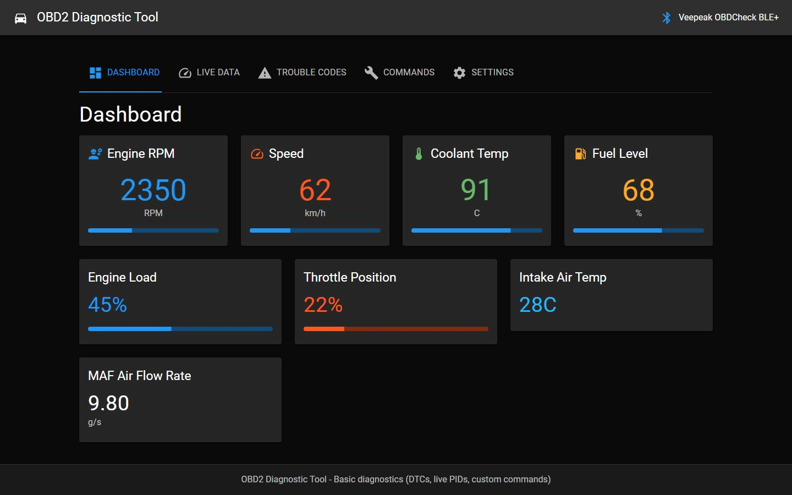

# Onboard Diagnostics Tool

Onboard Diagnostics Tool is a proprietary browser-based OBD2 scanner built with React and Vite. It connects to ELM327-compatible Bluetooth adapters using Web Bluetooth.



## Rights Notice

Copyright (c) 2026 Ryan P. Walsh. All rights reserved.

This repository is published for public viewing and professional reference only. No license is granted to use, copy, modify, distribute, deploy, or create derivative works from this software without prior written permission from Ryan P. Walsh. This codebase is proprietary commercial software and is not open source. See LICENSE.md.

## Includes

- Adapter connect and disconnect
- Stored DTC read and clear
- Live PID monitoring with charts
- VIN read (when supported)
- Custom hex command console

## Requirements

- Chrome or Edge with Web Bluetooth support
- HTTPS context or localhost
- Compatible Bluetooth OBD2 adapter

## Build

```bash
npm ci
npm run build
```

## Run

```bash
npm run dev
```
